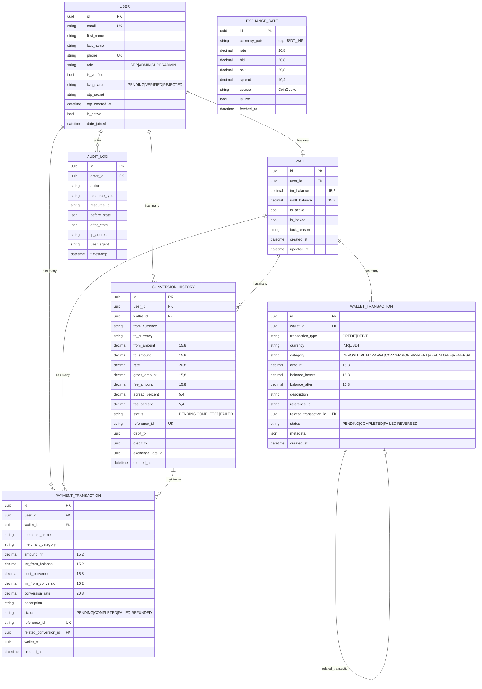

# NexusPay — ER Diagram

## Entity Relationship Overview

## Key Design Decisions

### Decimal Precision
- **INR balances**: `DecimalField(max_digits=15, decimal_places=2)` — supports up to ₹9,999,999,999,999.99
- **USDT balances**: `DecimalField(max_digits=15, decimal_places=8)` — 8 decimal places for crypto precision
- **Exchange rates**: `DecimalField(max_digits=20, decimal_places=8)` — high precision for rate calculations
- **NO float fields** anywhere in financial data

### Immutable Ledger
- `WalletTransaction` records are never updated after creation
- `balance_before` and `balance_after` are stored for every transaction (point-in-time snapshot)
- Reversals create a **new** transaction (REVERSAL type) and mark original as `REVERSED`
- Cascade is `PROTECT` — transactions cannot be deleted if wallet exists

### Atomic Operations
- All balance updates use `select_for_update()` to acquire row-level locks
- Multi-step operations (e.g., USDT→INR + INR payment) wrapped in `transaction.atomic()`
- Failed conversions roll back all DB changes automatically
